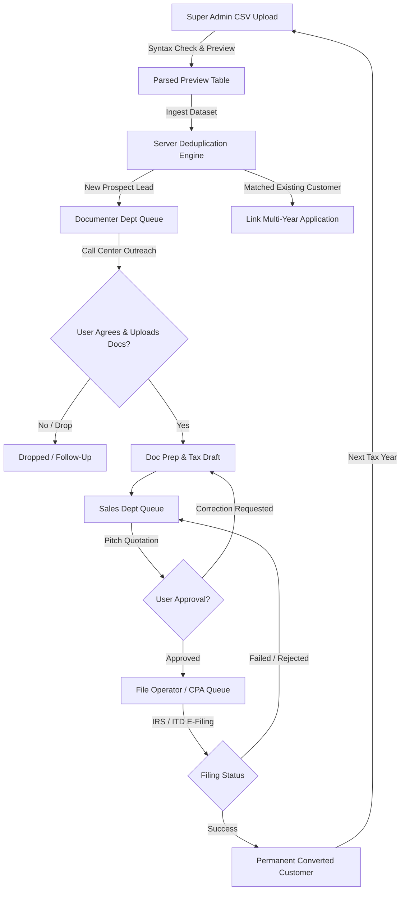

# TaxCRM Engine — Application Architecture & Workflow Guide

## 1. Executive Workflow & Lifecycle State Machine

The **TaxCRM Engine** orchestrates the end-to-end lifecycle of taxpayer leads across departments, starting from Super Admin Bulk Lead Ingestion through Documenter outreach, Sales quotation, CPA e-filing execution, and long-term customer retention:



---

## 2. Frontend Feature Architecture & Clean Code Standards

To guarantee maximum readability, maintainability, and clean separation of concerns, all application features follow a strict **Hooks-First, Stateless Component & Modular Structure**:

```
frontend/src/features/admin/
├── columns/                  # 📊 Table column definitions & cell renderers
│   ├── bulk-import-columns.tsx
│   └── index.ts
├── components/               # 🎨 Stateless UI components (pure presentational)
│   ├── BulkImportHero.tsx
│   ├── BulkImportDropzone.tsx
│   ├── BulkImportStats.tsx
│   ├── BulkImportTable.tsx
│   ├── AdminStatsOverview.tsx
│   └── AdminRecentActivity.tsx
├── hooks/                    # 🪝 Business logic, state, side-effects, sub-hooks
│   ├── useBulkImport.ts       # Orchestration hook with documented return groups
│   ├── useCSVFileUpload.ts   # Dedicated file drag & drop + RFC 4180 parsing
│   ├── useLeadTableFilters.ts# Dedicated search filtering & selection state
│   ├── useAdminDashboard.ts  # Admin navigation & active tab state
│   └── index.ts
├── screens/                  # 📱 Composite page screens
│   ├── BulkLeadImportScreen.tsx
│   └── AdminDashboardScreen.tsx
├── types/                    # 🏷️ Strongly typed TypeScript interfaces
│   ├── bulk-import.types.ts
│   └── index.ts
├── utils/                    # 🛠️ Utility functions (CSV parser, sample generator)
│   └── csv-helper.ts
└── services/                 # 🌐 Axios / Fetch API client services
    └── admin-service.ts
```

---

## 3. Modular Hook Decomposition Pattern

Rather than a single monolithic hook with confusing return values, business logic is split into focused, single-responsibility sub-hooks composed cleanly:

### 1. `useCSVFileUpload`
- **Responsibility**: File drag-and-drop listeners, file validation, RFC 4180 parsing, 1-click sample demo data, CSV template download, file reset.
- **Location**: [`src/features/admin/hooks/useCSVFileUpload.ts`](file:///c:/coding/ath-crm/frontend/src/features/admin/hooks/useCSVFileUpload.ts)

### 2. `useLeadTableFilters`
- **Responsibility**: Real-time debounced search query, status filtering (`ALL`, `VALID`, `INVALID`), and multi-row selection.
- **Location**: [`src/features/admin/hooks/useLeadTableFilters.ts`](file:///c:/coding/ath-crm/frontend/src/features/admin/hooks/useLeadTableFilters.ts)

### 3. `useBulkImport` (Main Orchestrator)
- **Responsibility**: Composes `useCSVFileUpload` + `useLeadTableFilters`, manages dataset lifecycle (`rows`, `taxYear`, `stats`), and handles ingestion triggers.
- **Documented Return Categories**:
  - `📁 [File & Upload State]`: `file`, `fileName`, `fileSize`, `isDragOver`, `isParsing`
  - `🔍 [Search & Filter State]`: `searchQuery`, `statusFilter`, `selectedRows`
  - `📊 [Dataset & Stats]`: `taxYear`, `rows`, `filteredRows`, `stats`
  - `⚙️ [Modal & Ingestion State]`: `isIngesting`, `showConfirmModal`
  - `🚀 [Action Handlers]`: `handleDrop`, `handleLoadDemoData`, `handleDownloadTemplate`, `handleProceedIngestion`, `handleConfirmIngestion`
- **Location**: [`src/features/admin/hooks/useBulkImport.ts`](file:///c:/coding/ath-crm/frontend/src/features/admin/hooks/useBulkImport.ts)

---

## 4. Table Columns Modularization Pattern

All table headers, custom cell formatting, and health icons are maintained in the dedicated `columns/` folder:
- **Location**: [`src/features/admin/columns/bulk-import-columns.tsx`](file:///c:/coding/ath-crm/frontend/src/features/admin/columns/bulk-import-columns.tsx)
- **Functions Exported**:
  - `getBulkImportColumns()`: Standard `ColumnDef<ParsedLeadRow>[]` array.
  - `renderStatusIcon(status, message)`: 🟢 Valid / 🔴 Alert status badges.
  - `renderValidationBadge(status, message)`: Informative diagnosis badges.

---

## 5. 3-Tier Master Database Architecture (Backend)

The database schema solves multi-department lead transfers and multi-year filings through 3 tiers:

```
Tier 1: USERS (Universal identity & auth for Staff and Clients)
   │
   ▼ 1:1
Tier 2: CUSTOMER_PROFILES (Permanent master record; SSN/TIN & Email deduplication)
   │
   ▼ 1:N
Tier 3: TAX_APPLICATIONS (Yearly filing case moving through department stages)
   │
   ├── STAGE_HISTORY (Immutable transition audit trail)
   ├── CALL_LOGS (Documenter & Sales communication history)
   ├── TAX_DOCUMENTS (W-2, 1099, 1040 document vault)
   └── SALES_QUOTES (Fee negotiation and client approvals)
```

---

## 6. Color & UI Styling Standards
* **Primary Accent Color**: **Tax Emerald Green (`#16A34A` / `emerald-600`)**
* **Typography**: Strictly **Poppins** (`font-sans`), maximum font-weight `700 (font-bold)`.
* **Prohibited**: Raw ad-hoc table/modal primitives, forced ALL-CAPS uppercase transforms.
* **Mandatory Component Catalog**:
  * Tables: `AppTable` (with built-in pagination, sorting, search)
  * Modals: `AppModal`
  * Dialogs: `AppConfirmDialog`
  * Inputs: `AppSearchInput`, `AppCopyButton`, `AppSelect`, `AppDatePicker`, `AppImageUpload`
