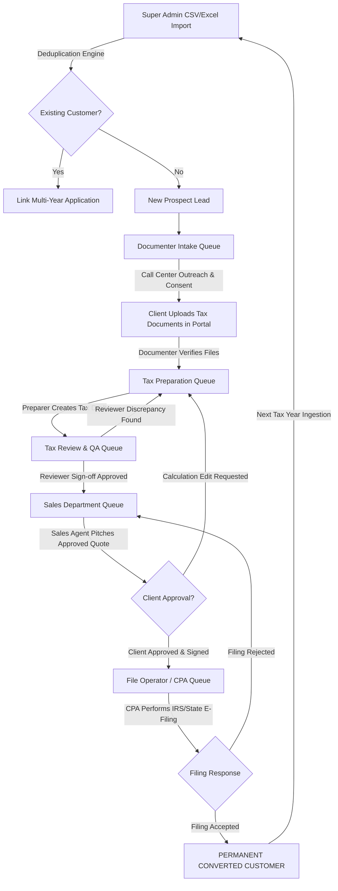

# Scope of Work (SOW) & System Requirement Specification (SRS)
## Project: Tax Filing CRM Platform ("TaxCRM Engine")

---

## 1. Executive Summary & Domain Scope

The **Tax Filing CRM Platform** is a specialized, multi-tiered Enterprise Customer Relationship Management and Workflow Automation System custom-built for **Tax Filing Operations** (Individual & Corporate Tax Processing).

Unlike general IT consulting or healthcare CRMs, this platform is specifically designed around the lifecycle of a Taxpayer: from initial lead acquisition via bulk CSV/Excel import, through document collection, dedicated tax calculation & preparation, senior tax compliance review & QA sign-off, quote negotiation, electronic filing (e-filing) execution, and long-term Year-over-Year (YoY) customer retention.

---

## 2. Role Hierarchy & Multi-Role Access Control Matrix

The system follows a flexible **Role-Based Access Control (RBAC)** architecture supporting multi-role assignments:

```
                                ┌─────────────────────────┐
                                │       ADMINISTRATOR     │
                                └────────────┬────────────┘
                                             │
         ┌───────────────────────────────────┼───────────────────────────────────┐
         │                                   │                                   │
┌────────┴───────────────┐          ┌────────┴────────┐                 ┌────────┴────────┐
│ TAX OPERATIONS DEPT    │          │   SALES DEPT    │                 │  FILE OPERATOR  │
├────────────────────────┤          ├─────────────────┤                 ├─────────────────┤
│ Department Manager     │          │ Sales Manager   │                 │ File Op Manager │
│ Team Leader (Optional) │          │ Sales TL (Opt)  │                 │ File Op TL (Opt)│
│ Documenter Intake Agent│          │ Sales Agent     │                 │ File Op / CPA   │
│ Tax Preparer           │          └─────────────────┘                 └─────────────────┘
│ Tax Reviewer (QA)      │                   │                                   │
└────────────────────────┘                   │                                   │
         │                                   │                                   │
         └───────────────────────────────────┼───────────────────────────────────┘
                                             │
                                ┌────────────┴────────────┐
                                │   USER / TAXPAYER PORTAL│
                                └─────────────────────────┘
```

### 2.1 Staff Roles & Departmental Responsibilities

1. **System Administrator (Super Admin)**
   - Unrestricted global access.
   - Responsible for Bulk Excel/CSV Lead Ingestion, Global System Settings, User & Staff Provisioning, Department Alignment, and Audit Monitoring.

2. **Tax Operations Department**
   - **Department Manager**: Oversees calling queues, preparation queues, reviewer queues, and rebalances staff capacity.
   - **Team Leader (Optional)**: Monitors daily team metrics, callback quotas, and turnaround SLAs.
   - **Documenter Agent (Calling & Intake)**: Conducts outreach calls, qualifies interest, logs call dispositions, and collects/verifies client documents (W-2, 1099, IDs). **Does NOT prepare returns or send directly to Sales.**
   - **Tax Preparer (`DOC_PREPARER`)**: Receives verified documents, performs gross income, deduction, and tax credit calculations, and prepares the Form 1040 / calculation draft. Submits draft to the Review Queue.
   - **Tax Reviewer (`DOC_REVIEWER`)**: Senior QA specialist/CPA who verifies computations against IRS rules and audit guidelines.
     - *If Review Fails*: Routes lead back to Tax Preparer with diagnostic correction notes.
     - *If Review Approved*: Approves tax draft and promotes lead to the **Sales Department Queue**.

3. **Multi-Role Assignment Capability (Critical Rule)**
   - Staff members can hold **Multiple Operational Roles** (e.g., a user can have both `DOC_PREPARER` and `DOC_REVIEWER` roles, or `DOC_AGENT` + `DOC_PREPARER`).
   - **4-Eyes Compliance Guardrail**: When a staff member prepares a tax calculation, the system prevents the same user from reviewing/approving their own prepared return.

4. **Sales Department (Quotation & Pitching)**
   - **Sales Manager**: Receives **Reviewer-Approved** leads, distributes to Sales Agents.
   - **Sales Agent**: Pitches finalized computation and service fee quotes to the taxpayer.
     - *If Client Requests Correction*: Routes lead back to Tax Preparer.
     - *If Client Approves*: Collects fee authorization and routes to File Operator Queue.

5. **File Operator Department (CPA & E-Filing Execution)**
   - **File Operator Manager**: Manages filing batches and transmission deadlines.
   - **File Operator (CPA / E-File Specialist)**: Performs electronic transmission with IRS / State tax authorities.
     - *If Filing Fails*: Routes back to Sales/Preparation with rejection codes.
     - *If Filing Succeeds*: Converts taxpayer into a permanent "Customer" with archived filing acknowledgment.

6. **User / Taxpayer (Client Role)**
   - Client portal access created automatically upon Documenter qualification.
   - Secure document upload vault (W-2, 1099, 1040, Bank Statements).
   - Reviews approved tax calculation summary and fee quotes.
   - Digital sign-off and live tracking of filing status.

---

## 3. End-to-End Core Lifecycle & Workflow State Machine



---

## 4. Optimized Database Architecture (3-Tier Master Schema)

To support multi-department handoffs, dedicated preparation/review stages, and multi-year filings without data duplication:

1. **`users` (Identity & Multi-Role Layer)**: Universal auth table for all staff and clients with support for single or multi-role permission arrays.
2. **`customer_profiles` (Master Taxpayer Profile)**: Single permanent profile per individual/corporate client (SSN/TIN & Email deduplication).
3. **`tax_applications` (Yearly Filing Pipeline Entity)**: One row per Tax Year per Customer, moving through stage milestones.

```
┌───────────────────────┐        ┌─────────────────────────┐
│        USERS          │        │    CUSTOMER_PROFILES    │
├───────────────────────┤        ├─────────────────────────┤
│ id (PK)               │ 1    1 │ id (PK)                 │
│ email (Unique)        ├───────►│ user_id (FK, Unique)    │
│ password_hash         │        │ ssn_tin / pan           │
│ roles (Enum Array:    │        │ phone, first_name, etc. │
│   ADMIN, DOC_AGENT,   │        │ is_converted_customer   │
│   DOC_PREPARER,       │        └────────────┬────────────┘
│   DOC_REVIEWER, SALES,│                     │ 1
│   FILE_OP, TAXPAYER)  │                     │
└───────────────────────┘                     │ *
                                 ┌────────────┴────────────┐
                                 │    TAX_APPLICATIONS     │
                                 ├─────────────────────────┤
                                 │ id (PK)                 │
                                 │ customer_id (FK)        │
                                 │ tax_year (2024, 2025)   │
                                 │ current_stage           │
                                 │ assigned_doc_agent_id   │
                                 │ assigned_preparer_id    │
                                 │ assigned_reviewer_id    │
                                 │ assigned_sales_agent_id │
                                 │ assigned_file_op_id     │
                                 └────────────┬────────────┘
                                              │
         ┌───────────────────┬────────────────┼───────────────────┬───────────────────┐
         │ 1                 │ 1              │ 1                 │ 1                 │ 1
         │ *                 │ *              │ *                 │ *                 │ *
┌────────┴────────┐ ┌────────┴────────┐ ┌─────┴─────┐ ┌───────────┴─────────┐ ┌──────┴───────┐
│  STAGE_HISTORY  │ │  TAX_DOCUMENTS  │ │ CALL_LOGS │ │ PREPARATION_REVIEWS │ │ SALES_QUOTES  │
└─────────────────┘ └─────────────────┘ └───────────┘ └─────────────────────┘ └───────────────┘
```

### 4.1 SQL DDL Schema Definition

```sql
-- 1. USERS TABLE (Universal Identity with Multi-Role Support)
CREATE TABLE users (
    id UUID PRIMARY KEY DEFAULT gen_random_uuid(),
    email VARCHAR(255) NOT NULL UNIQUE,
    password_hash VARCHAR(255) NOT NULL,
    role VARCHAR(50) NOT NULL, -- Primary default role
    roles VARCHAR(50)[] DEFAULT ARRAY['DOC_AGENT'], -- Multi-role permission array
    is_active BOOLEAN DEFAULT TRUE,
    created_at TIMESTAMP WITH TIME ZONE DEFAULT CURRENT_TIMESTAMP
);

-- 2. CUSTOMER PROFILES (Permanent Master Record)
CREATE TABLE customer_profiles (
    id UUID PRIMARY KEY DEFAULT gen_random_uuid(),
    user_id UUID UNIQUE REFERENCES users(id) ON DELETE CASCADE,
    first_name VARCHAR(100) NOT NULL,
    last_name VARCHAR(100) NOT NULL,
    phone VARCHAR(20) NOT NULL,
    ssn_tin VARCHAR(50) UNIQUE,
    visa_type VARCHAR(50),
    is_converted_customer BOOLEAN DEFAULT FALSE,
    created_at TIMESTAMP WITH TIME ZONE DEFAULT CURRENT_TIMESTAMP
);

-- 3. TAX APPLICATIONS (Pipeline State Machine)
CREATE TABLE tax_applications (
    id UUID PRIMARY KEY DEFAULT gen_random_uuid(),
    customer_id UUID NOT NULL REFERENCES customer_profiles(id) ON DELETE CASCADE,
    tax_year INT NOT NULL,
    filing_type VARCHAR(50) DEFAULT 'INDIVIDUAL',
    current_stage VARCHAR(50) NOT NULL CHECK (current_stage IN (
        'RAW_PROSPECT',          -- Uploaded via Admin CSV/Excel
        'DOC_OUTREACH',          -- Documenter calling outreach
        'DOC_INTAKE_VERIFIED',   -- Client uploaded docs & verified by Documenter
        'TAX_PREP_QUEUE',        -- In queue for Tax Preparer
        'TAX_PREPARING',         -- Tax Preparer working on calculation draft
        'TAX_REVIEW_QUEUE',      -- In queue for Senior Tax Reviewer
        'TAX_REVIEWING',         -- Senior Reviewer auditing calculation
        'TAX_REVIEW_REWORK',     -- Reviewer rejected -> returned to Preparer
        'SALES_PITCH_QUEUE',     -- Reviewer approved -> moved to Sales
        'SALES_PITCHING',        -- Sales Agent communicating quote to Client
        'CORRECTION_NEEDED',     -- Client requested calculation change -> returned to Preparer
        'FILING_QUEUE',          -- Client approved -> moved to File Operator
        'FILING_IN_PROGRESS',    -- File Operator executing e-filing
        'FILING_FAILED',         -- Filing rejected -> returned to Sales/Prep
        'FILING_SUCCESS',        -- Completed -> Converted Customer
        'DROPPED_CANCELLED'      -- Dropped for current season
    )),
    
    -- Assigned Personnel per Discipline
    assigned_doc_agent_id UUID REFERENCES users(id),
    assigned_preparer_id UUID REFERENCES users(id),
    assigned_reviewer_id UUID REFERENCES users(id),
    assigned_sales_agent_id UUID REFERENCES users(id),
    assigned_file_op_agent_id UUID REFERENCES users(id),
    
    tax_draft_summary JSONB,
    created_at TIMESTAMP WITH TIME ZONE DEFAULT CURRENT_TIMESTAMP,
    updated_at TIMESTAMP WITH TIME ZONE DEFAULT CURRENT_TIMESTAMP,
    UNIQUE (customer_id, tax_year)
);
```

---

## 5. Summary of New Business Rules

1. **Documenter Scope**: Strictly limited to calling, qualification, and document intake. Documenters **never** send leads directly to Sales.
2. **Mandatory 2-Step Preparation & QA**:
   - **Preparer** computes the return and generates the calculation draft.
   - **Reviewer** audits the draft and issues QA sign-off.
   - Only **Reviewer-Approved** drafts advance to Sales.
3. **Multi-Role Capability**: A staff member can perform Preparer and Reviewer duties, but cannot review their own return.
4. **Correction Loops**: Any change requested by Reviewer, Sales, or Client routes back to the Tax Preparer.
