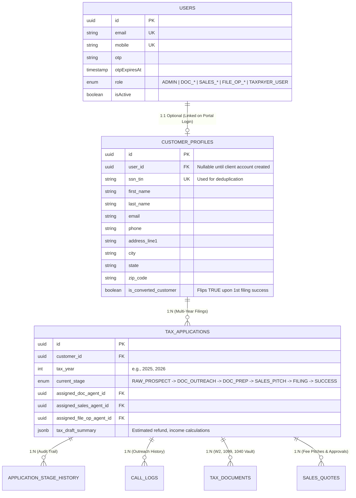
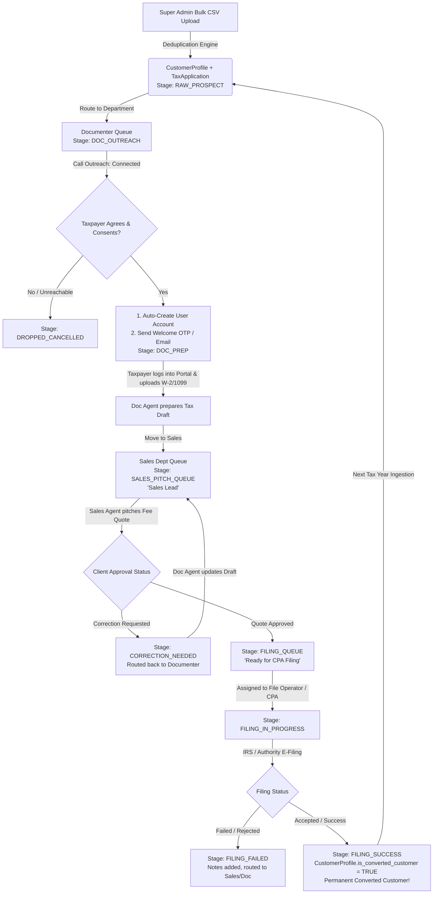
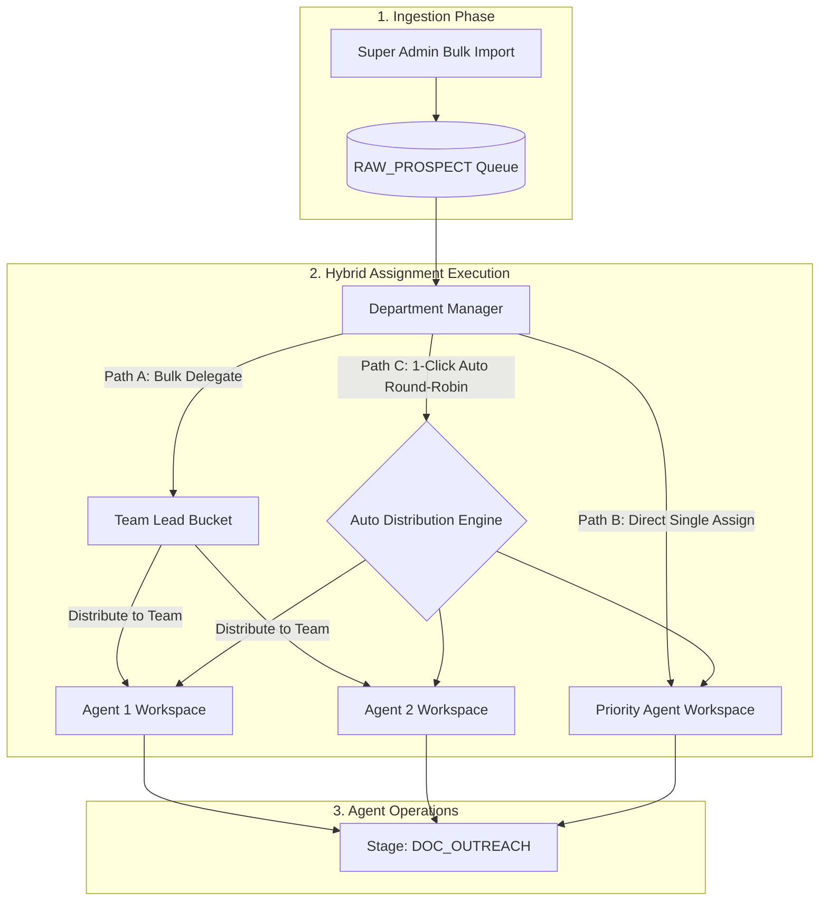

# TaxCRM Engine — Master Architecture & Data Flow Guide (`main_flow.md`)

> **Master Reference Document**: This document serves as the single source of truth for the database architecture, entity lifecycle, role transitions, department hierarchy, hybrid assignment flows, and multi-department data flow across the TaxCRM Engine platform.

---

## 1. Executive Summary & Core Architectural Principle

In the TaxCRM ecosystem, a single individual (taxpayer) moves through distinct departmental lifecycles:
1. **Raw Prospect** (Uploaded by Super Admin via Bulk CSV/Excel)
2. **Documenter Prospect / Prep** (Contacted by Call Center & Tax computation prepared)
3. **Sales Lead** (Pitched fee quotation & terms negotiated)
4. **Filing Case** (E-filed with IRS / Tax Authorities by CPA / File Operator)
5. **Permanent Converted Customer** (Retained for subsequent tax years)
6. **Client Portal User** (Authenticated taxpayer uploading documents and approving quotes)

### ⚠️ The Problem with Naive Single-Table Storage
* **Auth Pollution**: Creating a `User` auth row for all 10,000 raw CSV rows bloats the authentication database with inactive/unreachable records.
* **Multi-Year Duplication**: When a client returns for the next tax year (e.g., 2025 $\rightarrow$ 2026), duplicating their master profile leads to data desynchronization and fragmented history.
* **Stage Bloat**: Storing all department statuses in a single flat row leads to messy, unmaintainable tables with 60+ nullable columns.

### 💡 The Solution: 3-Tier Master Entity & State Machine Pattern
We separate the data into three clean, decoupled tiers:
* **Tier 1: Master Taxpayer Entity (`CustomerProfile`)** $\rightarrow$ Permanent profile (SSN/TIN, name, phone, email, customer badge).
* **Tier 2: Yearly Tax Application (`TaxApplication`)** $\rightarrow$ Moving pipeline case with state machine (`current_stage`, assigned staff, tax summaries).
* **Tier 3: Auth & Identity Layer (`User`)** $\rightarrow$ Authenticated logins with RBAC roles (Admin, Doc, Sales, File Op, and Taxpayer Client via Lazy Provisioning).

---

## 2. 3-Tier Database Relational Architecture



---

## 3. End-to-End State Machine & Role Lifecycle



---

## 4. Stage Breakdown & Department Transitions

| Stage Code | Department in Charge | User Designation in UI | Action / Event Trigger |
| :--- | :--- | :--- | :--- |
| **`RAW_PROSPECT`** | System / Admin | Raw Prospect | Admin CSV ingested; deduplication verified against existing `ssn_tin`. |
| **`DOC_OUTREACH`** | Documenter Dept | Outreach Prospect | Assigned Documenter agent calls taxpayer, logs call disposition (`Connected`, `Follow-up`). |
| **`DOC_PREP`** | Documenter + Client | Tax Prep Lead | Client agrees $\rightarrow$ `User` auth account created $\rightarrow$ Client uploads tax files to portal $\rightarrow$ Agent creates tax draft. |
| **`SALES_PITCH_QUEUE`** | Sales Manager | Qualified Lead | Tax draft finalized; queued for Sales Manager distribution. |
| **`SALES_PITCHING`** | Sales Agent | Active Sales Lead | Sales agent communicates quote and fee terms to taxpayer. |
| **`CORRECTION_NEEDED`** | Documenter Dept | Revision Lead | Client requested adjustment in calculation; returned to Documenter. |
| **`FILING_QUEUE`** | File Operator Mgr | Approved Filing Case | Client accepted fee quote; waiting for File Operator / CPA assignment. |
| **`FILING_IN_PROGRESS`** | File Operator (CPA)| In-Filing Case | CPA validates attachments and transmits e-file to IRS / Tax Department. |
| **`FILING_FAILED`** | File Operator / Sales| Rejected Case | Authority rejected filing (e.g., mismatch in W-2); failure report logged. |
| **`FILING_SUCCESS`** | Completed (All) | **Converted Customer**| E-filing acknowledgment received. `is_converted_customer` sets to `true`. |
| **`DROPPED_CANCELLED`**| Admin / Audit | Dropped Lead | Lead was not interested or cancelled for this tax year. Profile remains for future years. |

---

## 5. Department Role Hierarchy & Hybrid Lead Assignment Architecture

Every core operational department in the TaxCRM Engine follows a standardized **3-Tier Hierarchy** (`Manager` $\rightarrow$ `Team Lead` $\rightarrow$ `Agent`), governed by a **Flexible Hybrid Assignment Flow**.

### 🏢 1. Department Roles Matrix

| Department | 3-Tier Roles | Responsibilities & Scope |
|:---|:---|:---|
| **Documenter Dept** | 1. `DOC_MANAGER`<br/>2. `DOC_TEAM_LEAD`<br/>3. `DOC_AGENT` | • **Manager**: Oversees overall intake SLAs, reallocates lead batches between Team Leads.<br/>• **Team Lead**: Monitors daily agent outreach volumes, call conversions, and tax draft quality.<br/>• **Agent**: Direct phone calls, portal user onboarding, document review, and tax draft preparation. |
| **Sales Dept** | 1. `SALES_MANAGER`<br/>2. `SALES_TEAM_LEAD`<br/>3. `SALES_AGENT` | • **Manager**: Sets fee targets, approves special discounts, distributes incoming leads.<br/>• **Team Lead**: Supervises pipeline velocity, handles escalation pitches.<br/>• **Agent**: Calls clients, pitches fee quotes, secures payment/approval. |
| **File Operator Dept** | 1. `FILE_OP_MANAGER`<br/>2. `FILE_OP_TEAM_LEAD`<br/>3. `FILE_OP_AGENT` | • **Manager**: Oversees IRS transmission queues, rejection analysis, and CPA workload balance.<br/>• **Team Lead**: Distributes approved cases to CPAs based on state jurisdiction.<br/>• **Agent (CPA)**: Transmits e-filings to IRS / State Authorities, logs acknowledgments, and triggers customer conversion. |
| **Administration** | `ADMIN` (Super Admin) | Full global authority, bulk lead ingestion, staff directory management, system configuration. |
| **Client Portal** | `TAXPAYER_USER` | Authenticated client uploading tax documents and approving quotations. |

---

### 🔀 2. Hybrid Lead Assignment Workflow

The system supports both **Hierarchical Delegation** (for bulk scalability) and **Direct Assignment** (for priority cases), plus **Automated Round-Robin**:



#### Assignment Rules & Capabilities:
1. **Path A: Hierarchical Flow (Enterprise Scale)**:
   - Manager assigns a bulk batch (e.g. 500 leads) to a `DOC_TEAM_LEAD`.
   - The Team Lead reviews agent availability and assigns batches (e.g. 50 leads each) to their team of `DOC_AGENT`s.
2. **Path B: Direct Assignment Flow (Fast / VIP Leads)**:
   - Admin or Department Manager can bypass team leads and assign any specific lead directly to a specific Agent in 1 click.
3. **Path C: 1-Click Auto Round-Robin**:
   - The system automatically distributes unassigned leads equally across all active, online department agents.
4. **Re-allocation & Escalation**:
   - If an agent is on leave or inactive, the Manager or Team Lead can re-assign their pending queue to another active agent with audit tracking in `StageHistory`.

---

## 6. Department Query Matrix (How Roles View the Same Data)

The database does not duplicate records when moving across departments. Each department screen filters by `current_stage`:

```sql
-- 1. Super Admin View (All Records & Global Overview)
SELECT * FROM tax_applications 
JOIN customer_profiles ON tax_applications.customer_id = customer_profiles.id;

-- 2. Documenter Department Queue
SELECT * FROM tax_applications 
WHERE current_stage IN ('DOC_OUTREACH', 'DOC_PREP', 'CORRECTION_NEEDED')
  AND (
    assigned_doc_agent_id = :currentUserId 
    OR :isDocManager = TRUE 
    OR :isDocTeamLead = TRUE
  );

-- 3. Sales Department Queue (Viewing as "Sales Leads")
SELECT * FROM tax_applications 
WHERE current_stage IN ('SALES_PITCH_QUEUE', 'SALES_PITCHING')
  AND (
    assigned_sales_agent_id = :currentUserId 
    OR :isSalesManager = TRUE 
    OR :isSalesTeamLead = TRUE
  );

-- 4. File Operator / CPA Queue (Viewing as "Filing Cases")
SELECT * FROM tax_applications 
WHERE current_stage IN ('FILING_QUEUE', 'FILING_IN_PROGRESS')
  AND (
    assigned_file_op_id = :currentUserId 
    OR :isFileOpManager = TRUE 
    OR :isFileOpTeamLead = TRUE
  );

-- 5. Taxpayer Client Portal (Authenticated Client View)
SELECT * FROM tax_applications 
WHERE customer_id = :loggedInTaxpayerCustomerId
ORDER BY tax_year DESC;
```

---

## 7. Lazy Client Portal Provisioning (Security & Clean DB)

1. **Upload Time**: Admin uploads CSV containing 5,000 records.
   * Creates 5,000 `CustomerProfile` records (if new).
   * Creates 5,000 `TaxApplication` records with `current_stage = RAW_PROSPECT`.
   * **`User` records are NOT created yet.**
2. **Consent Time**: Documenter Agent calls the prospect.
   * Prospect says: *"Yes, please review my W-2 and calculate my taxes."*
   * Documenter clicks **"Initiate Portal Access"** (or changes stage to `DOC_PREP`).
   * System creates a `User` record with `role = TAXPAYER_USER`.
   * System links `CustomerProfile.user_id = User.id`.
   * System triggers an automated Welcome Email with a secure magic login link or OTP setup.
3. **Client Portal Experience**:
   * Taxpayer logs in securely at `/login`.
   * Taxpayer accesses `/dashboard` with a client-centric UI:
     * **Step Progress Tracker**: (1. Upload Docs $\rightarrow$ 2. Review Draft $\rightarrow$ 3. Approve Fee $\rightarrow$ 4. Filing Done)
     * **Secure File Vault**: Upload W-2, 1099, ID proofs (`TaxDocuments` table).
     * **Quote Approval Panel**: Review quote prepared by Sales Agent and 1-Click Approve.

---

## 8. Multi-Year & Retention Lifecycle (Year-over-Year Retention)

When the 2026 tax year ends and the 2027 tax season starts:
1. Admin uploads the new 2027 leads CSV.
2. The **Deduplication Engine** matches the incoming `ssn_tin` or `email` against `customer_profiles`.
3. If an existing profile is found:
   * It skips creating a new `CustomerProfile`.
   * It creates a new `TaxApplication` row with `tax_year = 2027` and `current_stage = RAW_PROSPECT`.
   * The client's existing `User` account and previous 2026 tax history remain linked and completely intact!
4. The client can view both **2026 (Completed)** and **2027 (In Progress)** filings inside their portal dropdown.

---

## 9. Complete Multi-File Prisma Schema Architecture

### `prisma/schema/base.prisma`
```prisma
datasource db {
  provider = "postgresql"
  url      = env("DATABASE_URL")
}

generator client {
  provider        = "prisma-client-js"
  previewFeatures = ["prismaSchemaFolder"]
}
```

### `prisma/schema/user.prisma`
```prisma
enum Role {
  ADMIN
  DOC_MANAGER
  DOC_TEAM_LEAD
  DOC_AGENT
  SALES_MANAGER
  SALES_TEAM_LEAD
  SALES_AGENT
  FILE_OP_MANAGER
  FILE_OP_TEAM_LEAD
  FILE_OP_AGENT
  TAXPAYER_USER
}

model User {
  id           String    @id @default(uuid())
  email        String?   @unique
  mobile       String?   @unique
  otp          String?
  otpExpiresAt DateTime?
  role         Role      @default(TAXPAYER_USER)
  isActive     Boolean   @default(true)
  createdAt    DateTime  @default(now())
  updatedAt    DateTime  @updatedAt

  customerProfile CustomerProfile?

  assignedDocApps   TaxApplication[] @relation("DocAgentApps")
  assignedSalesApps TaxApplication[] @relation("SalesAgentApps")
  assignedFileApps  TaxApplication[] @relation("FileOpApps")

  stageHistories StageHistory[]
  callLogs       CallLog[]
  uploadedDocs   TaxDocument[]
  salesQuotes    SalesQuote[]

  @@index([email])
  @@index([mobile])
}
```

### `prisma/schema/customer.prisma`
```prisma
model CustomerProfile {
  id                  String   @id @default(uuid())
  userId              String?  @unique
  user                User?    @relation(fields: [userId], references: [id], onDelete: SetNull)
  ssnTin              String?  @unique
  firstName           String
  lastName            String
  email               String?
  phone               String
  addressLine1        String?
  city                String?
  state               String?
  zipCode             String?
  isConvertedCustomer Boolean  @default(false)
  createdAt           DateTime @default(now())
  updatedAt           DateTime @updatedAt

  applications TaxApplication[]

  @@index([ssnTin])
  @@index([email])
  @@index([phone])
}
```

### `prisma/schema/tax_application.prisma`
```prisma
enum ApplicationStage {
  RAW_PROSPECT
  DOC_OUTREACH
  DOC_PREP
  SALES_PITCH_QUEUE
  SALES_PITCHING
  CORRECTION_NEEDED
  FILING_QUEUE
  FILING_IN_PROGRESS
  FILING_FAILED
  FILING_SUCCESS
  DROPPED_CANCELLED
}

model TaxApplication {
  id           String           @id @default(uuid())
  customerId   String
  customer     CustomerProfile  @relation(fields: [customerId], references: [id], onDelete: Cascade)
  taxYear      Int
  filingType   String           @default("INDIVIDUAL")
  currentStage ApplicationStage @default(RAW_PROSPECT)

  assignedDocAgentId String?
  assignedDocAgent   User?   @relation("DocAgentApps", fields: [assignedDocAgentId], references: [id])

  assignedSalesAgentId String?
  assignedSalesAgent   User?   @relation("SalesAgentApps", fields: [assignedSalesAgentId], references: [id])

  assignedFileOpId String?
  assignedFileOp   User?   @relation("FileOpApps", fields: [assignedFileOpId], references: [id])

  taxDraftSummary Json?
  createdAt       DateTime @default(now())
  updatedAt       DateTime @updatedAt

  stageHistories StageHistory[]
  callLogs       CallLog[]
  documents      TaxDocument[]
  quotes         SalesQuote[]

  @@unique([customerId, taxYear])
  @@index([currentStage])
  @@index([taxYear])
}

model StageHistory {
  id            String           @id @default(uuid())
  applicationId String
  application   TaxApplication   @relation(fields: [applicationId], references: [id], onDelete: Cascade)
  fromStage     ApplicationStage?
  toStage       ApplicationStage
  movedByUserId String
  movedByUser   User             @relation(fields: [movedByUserId], references: [id])
  remarks       String?
  createdAt     DateTime         @default(now())

  @@index([applicationId])
}

model CallLog {
  id                  String         @id @default(uuid())
  applicationId       String
  application         TaxApplication @relation(fields: [applicationId], references: [id], onDelete: Cascade)
  agentId             String
  agent               User           @relation(fields: [agentId], references: [id])
  disposition         String
  callSummary         String?
  callbackScheduledAt DateTime?
  createdAt           DateTime       @default(now())

  @@index([applicationId])
}

model TaxDocument {
  id               String         @id @default(uuid())
  applicationId    String
  application      TaxApplication @relation(fields: [applicationId], references: [id], onDelete: Cascade)
  uploadedByUserId String
  uploadedByUser   User           @relation(fields: [uploadedByUserId], references: [id])
  fileName         String
  filePath         String
  documentCategory String
  verificationStatus String       @default("PENDING")
  createdAt        DateTime       @default(now())

  @@index([applicationId])
}

model SalesQuote {
  id             String         @id @default(uuid())
  applicationId  String
  application    TaxApplication @relation(fields: [applicationId], references: [id], onDelete: Cascade)
  salesAgentId   String
  salesAgent     User           @relation(fields: [salesAgentId], references: [id])
  quoteAmount    Decimal        @db.Decimal(10, 2)
  discountAmount Decimal        @default(0.00) @db.Decimal(10, 2)
  status         String         @default("PITCHED")
  userFeedback   String?
  createdAt      DateTime       @default(now())

  @@index([applicationId])
}
```

---

## 10. Implementation Checklist & Architectural Constraints

When writing or modifying code across the application, verify compliance against this checklist:
- [ ] **No Monolithic User Creation**: Do not create a `User` entity on initial CSV ingestion.
- [ ] **3-Tier Hierarchy in All Departments**: Every department supports `Manager`, `Team Lead`, and `Agent` roles.
- [ ] **Hybrid Lead Assignment Flow**: Support Manager-to-Team-Lead delegation, Manager-to-Agent direct assignment, and Auto Round-Robin.
- [ ] **State-Driven Routing**: Department views must always filter `tax_applications` by `current_stage` rather than creating separate tables per department.
- [ ] **Audit Trail Integrity**: Every stage change must write an entry to `StageHistory` with `fromStage`, `toStage`, and `movedByUserId`.
- [ ] **Multi-Year Resiliency**: All customer filing lookups must be scoped to `(customerId, taxYear)`.
- [ ] **Stateless UI & Hooks-First**: All frontend components consuming this data must be presentational only, fetching through custom hooks and Zustand stores.
- [ ] **Strict Palette & Component Mandate**: Tax Emerald Green (`#16A34A`), Poppins typography (max font-weight 700), and reuse of `src/shared/components/` (`AppTable`, `AppModal`, `AppSidebar`, `AppPagination`, etc.).
