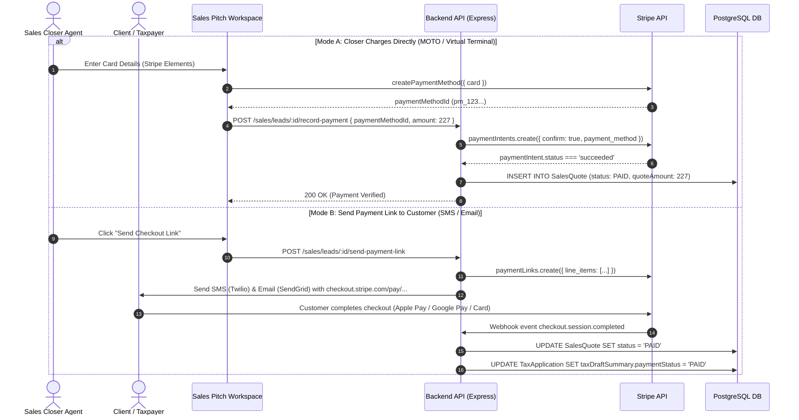
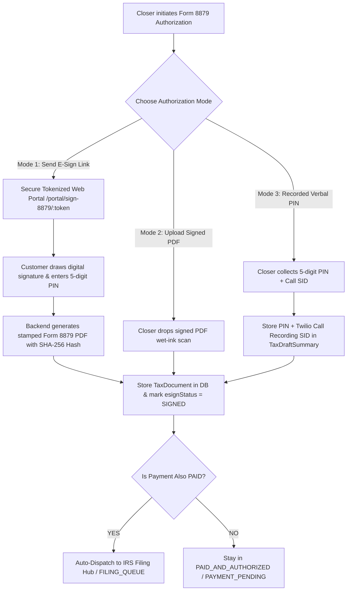

# 🚀 Sales Module: Payment Gateway & Form 8879 E-Sign Future Integration Roadmap

> **Author**: Google Deepmind Antigravity Pair Programming Architecture Team  
> **Target Audience**: Future AI Coding Agents & Full-Stack Developers  
> **Status**: Production Blueprint & Step-by-Step Implementation Spec  
> **Last Updated**: August 2026  

---

## 📌 Executive Summary & Context

In the TaxCRM Sales Department, once the Certified QA Return is reviewed and pitched to the customer by the Sales Closer:
1. **Service Fee Payment** must be collected from the taxpayer ($149 base + state add-ons, audit defense, FBAR).
2. **IRS Form 8879 (IRS e-file Signature Authorization)** must be legally authorized by the taxpayer before the return can be handed over to the IRS E-Filing Hub for MeF XML transmission.

Currently, the backend DB records (`SalesQuote`, `TaxDocument`, `TaxApplication.taxDraftSummary`, `StageHistory`) store real payment amounts, statuses, and uploaded document attachments.

This document details the **exact future production architecture** for:
1. **Stripe & PayPal Live Payment Integration** (Virtual Terminal + SMS/Email Checkout Link).
2. **IRS Form 8879 E-Sign Portal & PDF Engine** (Tokenized E-Sign Portal, PDF rendering with `pdf-lib`/Puppeteer, Tamper-Evident SHA-256 Audit Certificate).
3. **Telephonic Verbal PIN Recording & PBX Integration** (IRS Practitioner PIN Program, Twilio Voice Call Recording SID).

---

## 🏗️ 1. Payment Gateway Architecture (Stripe & Hosted Checkout)



### 1.1 Backend Implementation Details

1. **Install Dependencies**:
   ```bash
   npm install stripe
   ```
2. **Environment Variables**:
   ```env
   STRIPE_SECRET_KEY=sk_live_...
   STRIPE_WEBHOOK_SECRET=whsec_...
   STRIPE_PUBLIC_KEY=pk_live_...
   ```
3. **API Endpoint (`backend/src/features/sales/sales-service.ts`)**:
   ```typescript
   import Stripe from 'stripe';
   const stripe = new Stripe(process.env.STRIPE_SECRET_KEY!);

   // MOTO Virtual Terminal Direct Charge
   export async function processStripeCardCharge(applicationId: string, paymentMethodId: string, amount: number) {
     const paymentIntent = await stripe.paymentIntents.create({
       amount: Math.round(amount * 100), // in cents
       currency: 'usd',
       payment_method: paymentMethodId,
       confirm: true,
       description: `Tax Preparation Service Fee - App #${applicationId}`,
       automatic_payment_methods: { enabled: true, allow_redirects: 'never' },
     });
     return paymentIntent;
   }

   // Hosted Checkout Link Dispatch
   export async function createStripePaymentLink(applicationId: string, lead: any) {
     const session = await stripe.checkout.sessions.create({
       payment_method_types: ['card'],
       line_items: [
         {
           price_data: {
             currency: 'usd',
             product_data: { name: 'Form 1040 Certified Tax Prep & Filing' },
             unit_amount: Math.round(lead.totalServiceFee * 100),
           },
           quantity: 1,
         },
       ],
       mode: 'payment',
       customer_email: lead.taxpayerEmail,
       success_url: `${process.env.FRONTEND_URL}/portal/payment-success?session_id={CHECKOUT_SESSION_ID}`,
       cancel_url: `${process.env.FRONTEND_URL}/portal/payment-cancelled`,
       metadata: { applicationId },
     });
     return session.url;
   }
   ```

4. **Stripe Webhook Handler (`/api/webhooks/stripe`)**:
   - Handle `checkout.session.completed` and `payment_intent.succeeded`.
   - Update `SalesQuote.status = 'PAID'`.
   - Update `TaxApplication.taxDraftSummary.paymentStatus = 'PAID'`.
   - Check if `esignStatus === 'SIGNED'`. If so, automatically transition `currentStage` to `FILING_QUEUE`.

---

## ✍️ 2. IRS Form 8879 E-Sign Architecture



### 2.1 Mode 1: Secure Customer E-Sign Portal (`/portal/sign-8879/:token`)

1. **Token Generation**:
   - Generate JWT with 7-day expiry: `jwt.sign({ applicationId, taxpayerEmail }, process.env.ESIGN_SECRET, { expiresIn: '7d' })`.
2. **Public Customer Portal UI**:
   - Customer opens link on mobile or desktop: `https://app.taxcrm.com/portal/sign-8879/eyJhbGciOi...`
   - Shows summary of Form 1040 line items:
     - Federal Refund / Amount Owed
     - Standard / Itemized Deductions
     - Preparer & QA Signatures
   - Signature Component (`react-signature-canvas`):
     ```tsx
     <SignaturePad ref={sigPadRef} canvasProps={{ className: 'w-full h-48 border rounded-xl bg-white' }} />
     ```
   - Checkbox: *"Under penalties of perjury, I declare that I have examined a copy of my electronic individual income tax return and accompanying schedules..."*
   - Customer 5-Digit IRS Self-Select PIN input (e.g. `84920`).
3. **Stamped PDF Generation**:
   - Use `pdf-lib` to overlay the signature PNG and 5-digit PIN onto the IRS Form 8879 template:
     ```typescript
     import { PDFDocument } from 'pdf-lib';

     export async function stampForm8879(pdfBytes: Uint8Array, signaturePngBase64: string, pin: string, taxpayerName: string) {
       const pdfDoc = await PDFDocument.load(pdfBytes);
       const page = pdfDoc.getPage(0);
       const sigImage = await pdfDoc.embedPng(signaturePngBase64);
       
       // Draw signature on Part II Taxpayer Signature line
       page.drawImage(sigImage, { x: 120, y: 240, width: 180, height: 40 });
       page.drawText(pin, { x: 420, y: 245, size: 12 });
       page.drawText(new Date().toLocaleDateString('en-US'), { x: 490, y: 245, size: 10 });

       const stampedBytes = await pdfDoc.save();
       return stampedBytes;
     }
     ```
4. **Tamper-Evident SHA-256 Audit Certificate**:
   - Generate cryptographic hash of the signed PDF:
     ```typescript
     import crypto from 'crypto';
     const sha256Hash = crypto.createHash('sha256').update(stampedBytes).digest('hex');
     ```
   - Store certificate metadata: `{ ipAddress, timestamp, userAgent, sha256Hash }`.

---

## 📞 3. Mode 3: IRS Practitioner PIN Program (Recorded Verbal PIN)

Under IRS Publication 1345 guidelines for Practitioner PIN method:
- The taxpayer may authorize the ERO (Electronic Return Originator) to enter their 5-digit PIN on their behalf over the telephone, provided the phone call is recorded and retained for the statutory 3-year audit retention window.

### Implementation Checklist:
1. **Twilio Voice Call SID Capture**:
   - In CRM PBX/Dialer integration, capture the active call's `CallSid` (e.g. `CA1234567890abcdef...`).
2. **Taxpayer 5-Digit PIN**:
   - Capture taxpayer's verbal PIN (5 digits, non-zero starting number).
3. **Verbal Consent Audio Log**:
   - Attach Twilio recording link `https://api.twilio.com/2010-04-01/Accounts/.../Recordings/...` to `taxDraftSummary.form8879Audit.callRecordingUrl`.

---

## 🗄️ 4. Relational Database Mapping

| Prisma Entity | Field | Type | Description |
| :--- | :--- | :--- | :--- |
| `SalesQuote` | `quoteAmount` | `Decimal(10,2)` | Quoted fee ($227) |
| `SalesQuote` | `discountAmount`| `Decimal(10,2)` | Applied promotional discount |
| `SalesQuote` | `status` | `String` | `'PITCHED'`, `'SENT'`, `'PAID'` |
| `TaxDocument` | `documentCategory` | `String` | `'FORM_8879'` |
| `TaxDocument` | `fileName` | `String` | `IRS_Form_8879_Signed_Rahul_Choudhury.pdf` |
| `TaxDocument` | `verificationStatus` | `String` | `'VERIFIED'` |
| `TaxApplication` | `taxDraftSummary` | `Json` | `{ paymentStatus: 'PAID', esignStatus: 'SIGNED', paidAt, signedAt, esignMethod, form8879Pin }` |
| `TaxApplication` | `currentStage` | `Enum` | Transitions to `FILING_QUEUE` once both are verified |

---

## 🚀 5. Developer Quick-Start Instructions

When ready to implement the full live Stripe and Form 8879 portal:

1. **Stripe Backend**:
   - Add Stripe SDK to `backend/package.json`.
   - Implement `backend/src/features/sales/stripe-service.ts`.
   - Wire webhook receiver into `backend/src/routes/webhook-routes.ts`.

2. **Customer Portal Frontend**:
   - Create route `/portal/sign-8879/:token` in `frontend/src/routes/index.tsx`.
   - Use `react-signature-canvas` for drawing the digital signature.
   - Submit to `POST /api/portal/sign-8879`.

3. **PDF Generation**:
   - Add `pdf-lib` to backend.
   - Load template `backend/templates/f8879_2025.pdf`, overlay signature + PIN, and save to S3/local storage.

---

*This specification is preserved in the repository root at `sales_payment_and_esign_roadmap.md` for seamless handoff to future developers and AI agents.*
